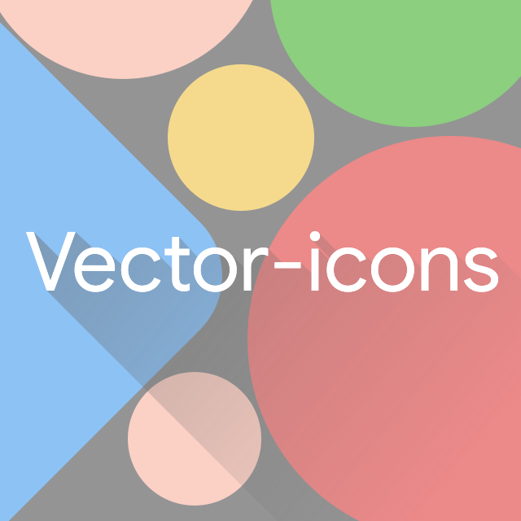
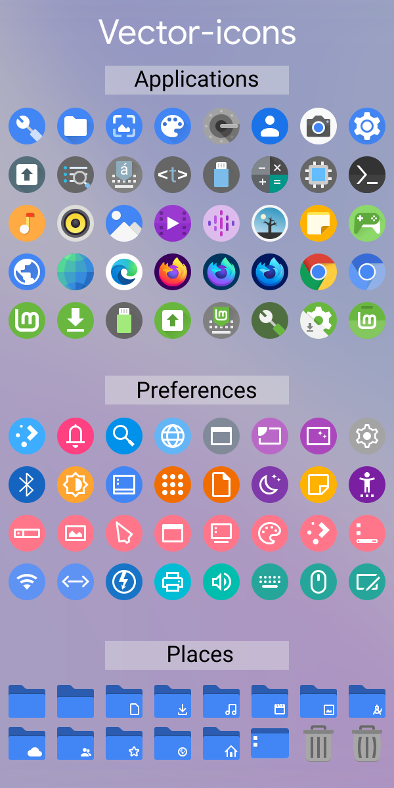
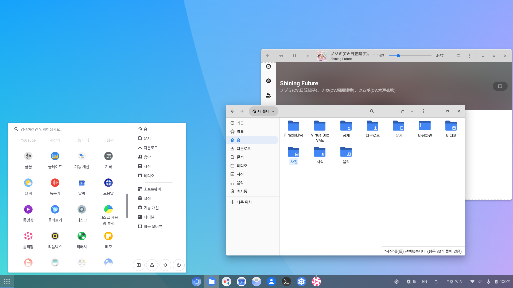
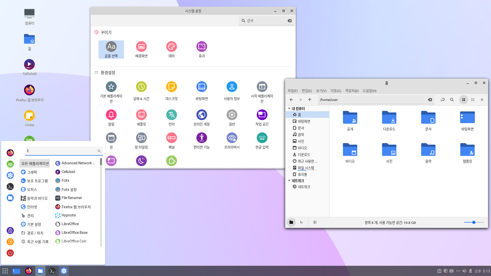
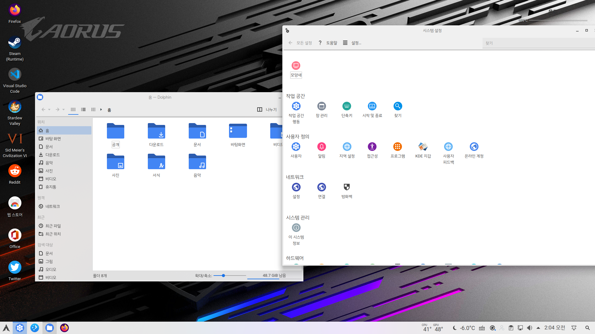
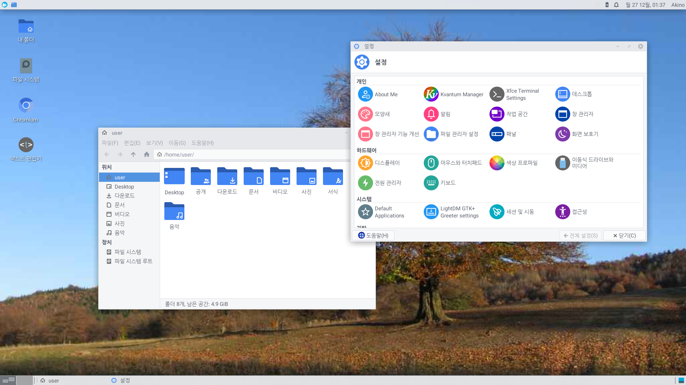

# Vector-icons

Google Pixel & Chrome OS Style Icons for Linux

## Based on

* Vimix-icon-theme (https://github.com/vinceliuice/vimix-icon-theme)

## Recommend Settings with this icon

* GTK Themes : Materia(https://github.com/nana-4/materia-theme), Materia KDE(https://github.com/PapirusDevelopmentTeam/materia-kde), ChromeOS(https://github.com/vinceliuice/ChromeOS-theme)
* Fonts : Roboto, Noto Sans CJK(Also known as Source Han Sans) Google Sans(Also known as Product Sans)
* GNOME Extensions : Dash to Panel

## Preview

## Sample

* GNOME

* Cinnamon

* KDE

* Xfce

